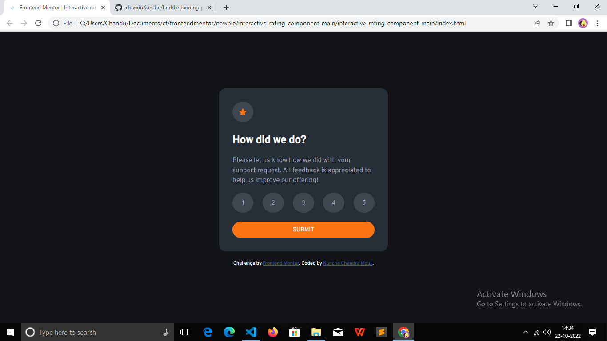
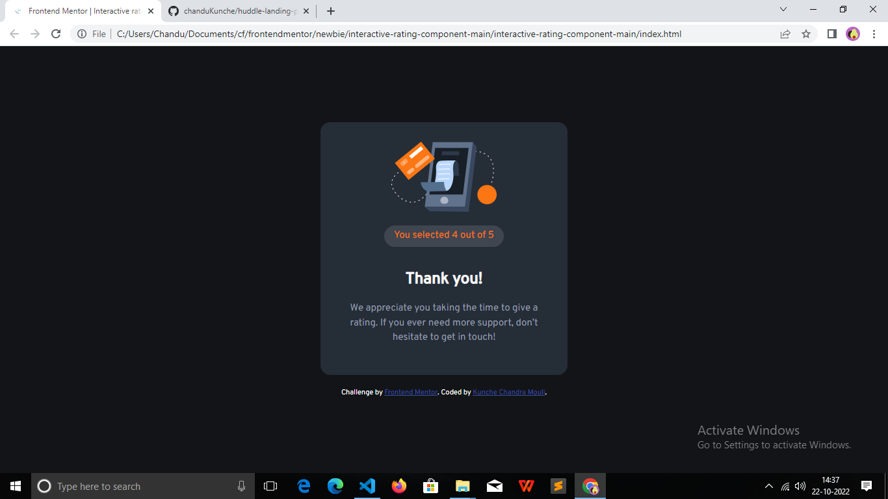
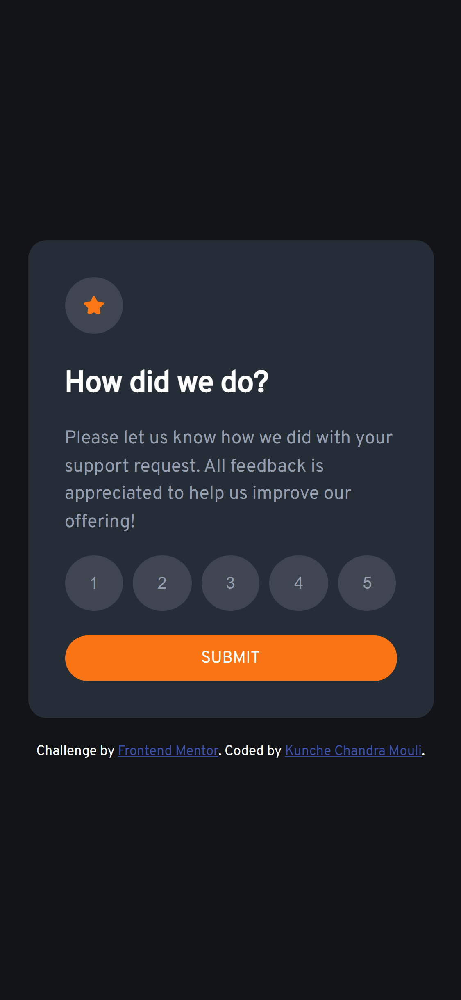

# Frontend Mentor - Interactive rating component solution

This is a solution to the https://www.frontendmentor.io/challenges/interactive-rating-component-koxpeBUmI. Frontend Mentor challenges help you improve your coding skills by building realistic projects. 

## Table of contents

- overview
  - the-challenge
  - screenshot
  - links
- my-process
  - built-with
  - what-i-learned
- author

## Overview

### The challenge

Users should be able to:

- View the optimal layout for the app depending on their device's screen size
- See hover states for all interactive elements on the page
- Select and submit a number rating
- See the "Thank you" card state after submitting a rating

### Screenshot

### Links

- Solution URL: https://github.com/chanduKunche/interactive-rating-component
- Live Site URL: https://chandukunche.github.io/interactive-rating-component/

## My process

### Built with

- Semantic HTML5 markup
- CSS custom properties
- Flexbox
- CSS Grid
- Mobile-first workflow

### What I learned

- how to design an interactive rating component using HTML, CSS and javascript.
- how to design using semantic HTML elements.
- how to use flexbox and grid CSS properties.
- how to build responsive webpages for big and small screens.
- Learnt how to design interactive elements
- Learnt about DOM manipulation and DOM updation.

## Author

- Frontend Mentor - https://www.frontendmentor.io/profile/chanduKunche

